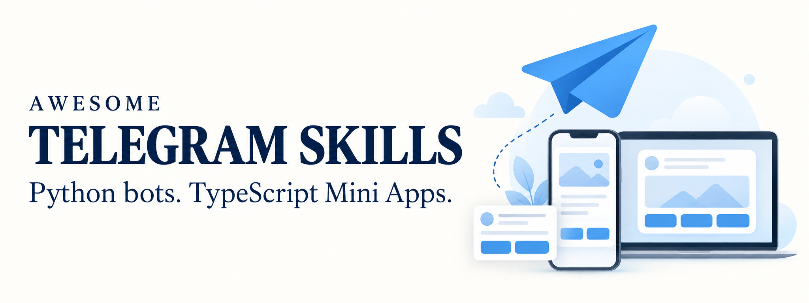
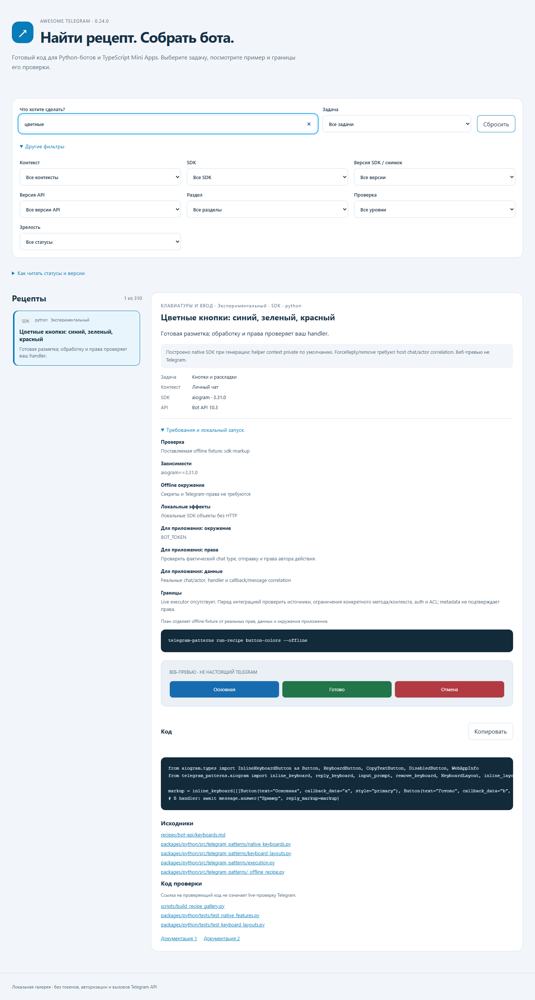

<p align="center">
  
</p>

# Awesome Telegram Skills

[](CHANGELOG.md)
[](#skills)
[](docs/v1-maturity.md)
[](LICENSE)
[](https://github.com/Zulut30/awesome-telegram-skills/actions/workflows/repository-checks.yml)

**Практические скиллы для ИИ, готовые компоненты и примеры разработки Telegram-ботов и Mini Apps.**

Скиллы помогают агенту выбрать решение и проверить результат. Библиотека дает переиспользуемый код, а рецепты показывают, как подключить его к вашему проекту. Основной стек — **Python + aiogram для ботов и backend, TypeScript для Mini Apps**.

[English](README.en.md) · [Быстрый старт](#quickstart) · [Пример кнопок](#buttons) · [Галерея](#gallery) · [Все скиллы](#skills) · [План 1.0](docs/library-roadmap-100.md)

**[Документация на GitHub Pages](https://zulut30.github.io/awesome-telegram-skills/)** · [Каждый скилл](https://zulut30.github.io/awesome-telegram-skills/skills/) · [Справочник API](https://zulut30.github.io/awesome-telegram-skills/api/) · [Инструкция для ИИ-агента](docs/for-agents.md).

> **Версия 0.24.0 — экспериментальная локальная поставка.** Приняты 30 из 100 пунктов плана. Пакеты пока не опубликованы в PyPI/npm; проверка на реальных Telegram-клиентах и платежных провайдерах остается отдельным этапом. Какие версии Python, Node.js, aiogram и Bot API поддерживаются и до какого срока — в [политике поддержки](docs/versioning.md#политика-поддержки).

## Можно ли брать в production

| Часть | Статус | Что это значит для вас |
| --- | --- | --- |
| 42 скилла для ИИ-агентов | 🟢 Можно использовать | Это инструкции: агент применяет их к вашему коду, решение и проверку вы оставляете за собой |
| Python-компоненты (39 групп) | 🟡 Экспериментально | Покрыты тестами с настоящим aiogram и тестовым транспортом; API может измениться в следующей минорной версии |
| TypeScript-компоненты (8 групп) | 🟡 Экспериментально | Проверены в Chrome на разных размерах экрана, но не в Telegram на телефоне |
| Рецепты (315) | 🟡 Проверены без Telegram | 196 — на настоящем SDK без сети, 20 — на заглушках, 99 — справочные и не запускались |
| Примеры приложений | 🟡 Учебные | Показывают, как собрать бота, магазин и групповой бот; это не готовые продукты |
| Работа в настоящем Telegram, на устройствах и с платежами | 🔴 Не проверено | Живой приемки на клиентах Telegram и у платежных провайдеров еще не было |

**Итог:** стабильных (stable) компонентов пока нет. Используйте библиотеку как основу с собственными тестами и закрепляйте точную версию; скиллы можно применять уже сейчас. [Подробно о зрелости](docs/v1-maturity.md).

## Что внутри

| Часть | Что получите |
| --- | --- |
| **42 скилла** | Архитектура, Bot API, Mini Apps, платежи, профили, безопасность, тестирование и развертывание |
| **47 групп компонентов** | Клавиатуры, формы, навигация, календари, медиа, состояния и проверка `initData`; [каталог](components.json) |
| **Python-пакет** | `telegram_patterns`: ядро и отдельные адаптеры aiogram; [API](packages/python/README.md) |
| **TypeScript-пакет** | `@awesome-telegram/patterns`: bridge, темы, viewport, safe areas, API-клиент, черновики и UI-основа; [API](packages/typescript/README.md) |
| **315 рецептов + CLI** | Поиск, фильтры, примеры кода, создание заготовок и `doctor`; [инструкция](docs/developer-tools-review.md) |

<a id="quickstart"></a>

## Быстрый старт

Не знаете, с чего начать? [Четыре пути на 10 минут](docs/start.md): первый бот, уже есть бот на aiogram, Mini App, работа с ИИ-агентом.

Команды даны для Windows (PowerShell) и для Linux и macOS (bash); где они совпадают, блок один.

```bash
git clone https://github.com/Zulut30/awesome-telegram-skills.git
cd awesome-telegram-skills
```

**Для ИИ.** Откройте репозиторий в Codex и вызовите нужный скилл:

```text
$telegram-bot-python Сделай бот записи на консультацию.
$telegram-code-patterns Подключи готовые формы и календарь.
$telegram-mini-app-architecture Спроектируй Mini App для телефона, планшета и ПК.
```

В Claude Code все 42 скилла ставятся одной командой как плагин из этого репозитория:

```bash
claude plugin marketplace add Zulut30/awesome-telegram-skills && claude plugin install telegram-skills@awesome-telegram-skills
```

После перезапуска сессии скиллы доступны как `/telegram-skills:telegram-bot-python` и т. п.; обновление — `claude plugin marketplace update awesome-telegram-skills`. Внутри сессии то же делают `/plugin marketplace add Zulut30/awesome-telegram-skills` и `/plugin install telegram-skills@awesome-telegram-skills`.

В Gemini CLI — тоже одной командой, все скиллы попадут в `~/.gemini/skills/`:

```bash
gemini skills install https://github.com/Zulut30/awesome-telegram-skills.git --path .agents/skills
```

Для существующего проекта перенесите нужные каталоги из `.agents/skills/` целиком вместе с `references`. Или используйте [установщик](scripts/install_skills.py):

```powershell
python scripts/install_skills.py --project "C:\path\to\my-bot" --skill telegram-bot-python --skill telegram-code-patterns --dry-run
```

```bash
python3 scripts/install_skills.py --project ~/projects/my-bot --skill telegram-bot-python --skill telegram-code-patterns --dry-run
```

Замените путь на существующий проект. Проверьте список и повторите команду без `--dry-run`, чтобы скопировать навыки. Навыки копируются в `.agents/skills/` — его читают Codex, GitHub Copilot, Cursor и Gemini CLI. Для Claude Code добавьте `--agent claude`: он читает только `.claude/skills/`, и после установки скилл доступен как `/telegram-bot-python`. `--agent all` ставит в оба каталога сразу, `--agent copilot|cursor|gemini` — в собственный каталог агента, а `--user` вместо `--project` — в домашний каталог для всех проектов. Установка навыков и установка пакетов — отдельные действия.

**Для Python-разработчика.** Нужен Python 3.11 или новее; активация окружения не требуется.

```powershell
python -m venv .venv
.\.venv\Scripts\python.exe -m pip install "./packages/python[aiogram]"
.\.venv\Scripts\python.exe -m telegram_patterns recipes --show two-columns
.\.venv\Scripts\python.exe examples/python/offline_keyboards.py
```

```bash
python3 -m venv .venv
.venv/bin/python -m pip install "./packages/python[aiogram]"
.venv/bin/python -m telegram_patterns recipes --show two-columns
.venv/bin/python examples/python/offline_keyboards.py
```

Последняя команда выполняет пример через тестовый транспорт без токена и обращений к Telegram. [Пошаговый запуск бота и Mini App](docs/quickstart.md). Живого бота можно проверить без основного аккаунта — в [тестовом окружении Telegram](docs/test-environment.md).

Что-то не работает? [Частые проблемы](docs/troubleshooting.md): 37 ситуаций от «бот молчит» и `409 Conflict` до initData и Stars — с причиной, командой проверки и решением.

**Для Mini App.** Нужен Node.js 20 или новее. Из корня репозитория:

```powershell
npm.cmd ci
npm.cmd run demo
```

```bash
npm ci
npm run demo
```

Откройте **http://127.0.0.1:4173**. Это локальный пример UI и восстановления запросов; для настоящего Mini App подключите Telegram host и свой backend. [Что демонстрирует пример](docs/component-library.md).

**Подключить пакеты к своему проекту без клонирования.** Wheel, npm tarball и `SHA256SUMS` каждой версии выкладываются в [GitHub Releases](https://github.com/Zulut30/awesome-telegram-skills/releases). Команды одинаковы для Linux, macOS и Windows:

```bash
pip install "awesome-telegram-patterns[aiogram] @ https://github.com/Zulut30/awesome-telegram-skills/releases/download/v0.24.0/awesome_telegram_patterns-0.24.0-py3-none-any.whl"
npm install https://github.com/Zulut30/awesome-telegram-skills/releases/download/v0.24.0/awesome-telegram-patterns-0.24.0.tgz
```

В PyPI и npm пакеты пока не опубликованы; не устанавливайте пакеты с такими именами из публичного реестра. [Как выпускаются версии](docs/releasing.md).

<a id="buttons"></a>

## Две кнопки в ряд — несколькими строками

```python
from telegram_patterns.aiogram import ActionButton, action_menu

keyboard = action_menu([
    ActionButton("Каталог", "catalog", style="primary"),
    ActionButton("Помощь", "help"),
    ActionButton("Подтвердить", "confirm", style="success"),
    ActionButton("Отмена", "cancel", style="danger"),
], columns=2)

# В вашем обработчике: await message.answer("Выберите действие", reply_markup=keyboard)
```

Для трех кнопок в ряд используйте `columns=3`. [Смешанные ряды, reply-клавиатуры, стили и custom emoji](docs/keyboard-layouts.md). Права, обработку нажатия и доступность оформления проверяет приложение.

<a id="gallery"></a>

## Найти нужный пример

Откройте **[галерею рецептов на сайте](https://zulut30.github.io/awesome-telegram-skills/recipes/)**: поиск по задаче, фильтры SDK и контекста, превью клавиатур, код с кнопкой «Копировать», источники и команды проверки. Галерея работает и на телефоне. Интерфейс показывает отдельно зрелость компонента и способ его проверки. Без интернета та же галерея открывается из клона: [gallery/index.html](gallery/index.html).

<details>
<summary>Посмотреть скриншот галереи 0.24.0</summary>



Скриншот веб-галереи; превью кнопок иллюстрирует разметку. Отображение в настоящем Telegram проверяется отдельно.

</details>

| Сценарий | Готовый пример |
| --- | --- |
| Клавиатуры и обработка ввода | [Бот](examples/python/keyboards_bot.py) · [offline-запуск](examples/python/offline_keyboards.py) |
| Запись на услугу и напоминания | [Сервисный бот](docs/service-bot.md) |
| Темы и модерация групп | [Групповой бот](docs/group-bot.md) |
| Каталог, корзина и Stars | [Магазин с Mini App](docs/shop-example.md) |

<a id="skills"></a>

## Скилл под вашу задачу

Начните с `telegram-project-planner` для нового проекта, `telegram-code-patterns` для готового кода или профильного скилла для узкой задачи. Каждый каталог самостоятельный; загружать весь набор не нужно.

<details>
<summary><strong>Открыть каталог всех 42 скиллов</strong></summary>

| Навык | Когда использовать |
| --- | --- |
| [telegram-project-planner](.agents/skills/telegram-project-planner/SKILL.md) | Спроектировать новый бот или Mini App, выбрать стек и границы MVP |
| [telegram-mini-app-ux](.agents/skills/telegram-mini-app-ux/SKILL.md) | Улучшить первый запуск, навигацию, формы и путь покупки |
| [telegram-bot-api](.agents/skills/telegram-bot-api/SKILL.md) | Добавить сообщения, медиа, кнопки или новый метод Bot API |
| [telegram-bot-python](.agents/skills/telegram-bot-python/SKILL.md) | Создать или изменить бот на aiogram / python-telegram-bot / pyTelegramBotAPI |
| [telegram-python-backend](.agents/skills/telegram-python-backend/SKILL.md) | Реализовать Python API, БД, миграции, права и надежные серверные операции |
| [telegram-mini-app-architecture](.agents/skills/telegram-mini-app-architecture/SKILL.md) | Спроектировать структуру, состояние и адаптивные экраны для телефона, планшета и ПК |
| [telegram-mini-app-performance](.agents/skills/telegram-mini-app-performance/SKILL.md) | Измерить и улучшить загрузку, отзывчивость, списки и запросы Mini App |
| [telegram-mini-app-network-recovery](.agents/skills/telegram-mini-app-network-recovery/SKILL.md) | Сохранять допустимые черновики и восстанавливать запросы при плохой сети |
| [telegram-mini-app-typescript](.agents/skills/telegram-mini-app-typescript/SKILL.md) | Подключить bridge/SDK, типы, API-клиент и сборку Mini App на TypeScript |
| [telegram-mini-app-native-capabilities](.agents/skills/telegram-mini-app-native-capabilities/SKILL.md) | Подключить геолокацию, биометрию, QR, storage, sharing и скачивание с fallback |
| [telegram-dialogs](.agents/skills/telegram-dialogs/SKILL.md) | Сделать многошаговый диалог, FSM, меню и восстановление сценария |
| [telegram-notifications](.agents/skills/telegram-notifications/SKILL.md) | Добавить напоминания и рассылки с очередью, отпиской и управляемыми повторами |
| [telegram-ai-bot](.agents/skills/telegram-ai-bot/SKILL.md) | Подключить языковую модель: потоковый ответ, остановка генерации, лимиты и приватность |
| [telegram-inline-mode](.agents/skills/telegram-inline-mode/SKILL.md) | Реализовать поиск и отправку результатов через `@bot query` |
| [telegram-groups](.agents/skills/telegram-groups/SKILL.md) | Работать с группами, каналами, модерацией и темами |
| [telegram-mini-app-ui](.agents/skills/telegram-mini-app-ui/SKILL.md) | Создать красивый адаптивный UI Mini App с темами, safe areas и доступностью |
| [telegram-mini-app-design-system](.agents/skills/telegram-mini-app-design-system/SKILL.md) | Создать переиспользуемые компоненты, токены, темы и согласованные UI-состояния |
| [telegram-mini-app-visual-regression](.agents/skills/telegram-mini-app-visual-regression/SKILL.md) | Настроить сравнение скриншотов с просмотренными эталонами |
| [telegram-mini-app-auth](.agents/skills/telegram-mini-app-auth/SKILL.md) | Проверять `initData` на сервере и создавать пользовательскую сессию |
| [telegram-web-login](.agents/skills/telegram-web-login/SKILL.md) | Подключить Telegram Login OIDC к сайту и безопасно связать аккаунты |
| [telegram-mini-app-integration](.agents/skills/telegram-mini-app-integration/SKILL.md) | Связать бот, Mini App и backend; настроить запуск и deep links |
| [telegram-payments](.agents/skills/telegram-payments/SKILL.md) | Добавить Stars, оплату физических товаров, подписки или возвраты |
| [telegram-subscription-access](.agents/skills/telegram-subscription-access/SKILL.md) | Выдавать и прекращать оплаченный доступ по периодам и событиям оплаты |
| [telegram-admin-panel](.agents/skills/telegram-admin-panel/SKILL.md) | Реализовать операторские действия с ролями, scope и журналом |
| [telegram-media-processing](.agents/skills/telegram-media-processing/SKILL.md) | Принимать, проверять и преобразовывать медиа, создавать превью и фоновые jobs |
| [telegram-testing](.agents/skills/telegram-testing/SKILL.md) | Проверить обработчики, интеграции и реальные сценарии в Telegram |
| [telegram-mini-app-device-qa](.agents/skills/telegram-mini-app-device-qa/SKILL.md) | Провести приемку в целевых Telegram-клиентах на доступных реальных устройствах |
| [telegram-deploy](.agents/skills/telegram-deploy/SKILL.md) | Запустить бот и Mini App, настроить webhook и эксплуатацию |
| [telegram-debugging](.agents/skills/telegram-debugging/SKILL.md) | Найти причину пропавших updates, ошибок API или проблем WebView |
| [telegram-observability](.agents/skills/telegram-observability/SKILL.md) | Внедрить связанные события, метрики и безопасные логи frontend/backend/worker |
| [telegram-security-review](.agents/skills/telegram-security-review/SKILL.md) | Проверить авторизацию, платежи, загрузки и обращения к внешним сервисам |
| [telegram-buttons](.agents/skills/telegram-buttons/SKILL.md) | Цвет кнопок, custom emoji icons и ограничения клавиатур |
| [telegram-profiles](.agents/skills/telegram-profiles/SKILL.md) | Данные профиля, Premium, фото, bio и разрешенное изменение профиля |
| [telegram-localization](.agents/skills/telegram-localization/SKILL.md) | Согласовать языки, plural forms, даты, суммы и длинные надписи бота и Mini App |
| [telegram-user-client](.agents/skills/telegram-user-client/SKILL.md) | Чтение выбранных чатов и истории авторизованного аккаунта через Telethon |
| [telegram-business-bots](.agents/skills/telegram-business-bots/SKILL.md) | Официальное подключение бота к разрешенным чатам аккаунта |
| [telegram-library-selection](.agents/skills/telegram-library-selection/SKILL.md) | Выбор SDK и проверка поддержки новых функций |
| [telegram-code-patterns](.agents/skills/telegram-code-patterns/SKILL.md) | Подключить готовые компоненты общей Python/TypeScript-библиотеки |
| [telegram-cryptopay](.agents/skills/telegram-cryptopay/SKILL.md) | CryptoBot / Crypto Pay: invoices, signatures и сверка оплаты |
| [telegram-platega](.agents/skills/telegram-platega/SKILL.md) | Platega.io: ссылки, callbacks, статусы, возвраты и подписки |
| [telegram-yookassa](.agents/skills/telegram-yookassa/SKILL.md) | ЮKassa: API, provider invoices, capture, refunds и уведомления |
| [telegram-payment-provider](.agents/skills/telegram-payment-provider/SKILL.md) | Stripe, Robokassa и другие провайдеры через отдельный adapter |

</details>

## Качество и границы

Поставка 0.24.0 прошла 77 этапов приемки: **460 Python-тестов, один пропуск, 26 TypeScript-тестов, 2435 автоматических браузерных проверок и 60 проверок первого запуска**. Собранные wheel/tarball устанавливались в отдельные consumer-проекты. [Отчет приемки](docs/v1-checks/031.json) · [Матрица поддержки](docs/support-matrix.md).

Каталог API содержит request-примеры; он не означает, что все возможности Telegram реализованы и испытаны в боевом приложении. Mini App UI — основа для вашего продукта; полная приемка на реальных телефонах, планшетах и ПК еще впереди. Платежные скиллы описывают интеграции Stars, Crypto Pay, Platega и ЮКассы; merchant-настройки и live-проверки относятся к конкретному проекту. Bot API, Mini Apps и пользовательские MTProto-сессии имеют отдельные границы доступа.

## Лицензия

Скиллы, библиотеки и примеры распространяются по лицензии [MIT](LICENSE): их можно использовать, изменять и включать в коммерческие проекты при сохранении уведомления об авторских правах. Файл лицензии входит в Python wheel и npm tarball, а поле `license: MIT` — во frontmatter каждого скилла, поэтому скопированный каталог скилла сохраняет условия.

Для изменений набора: [CONTRIBUTING.md](CONTRIBUTING.md). Уязвимости сообщайте приватно по [SECURITY.md](SECURITY.md). Участники соблюдают [кодекс поведения](CODE_OF_CONDUCT.md). Источники: [docs/sources.md](docs/sources.md). Развитие: [план из 100 пунктов](docs/library-roadmap-100.md) и [регистр выполнения](docs/v1-progress.json).
